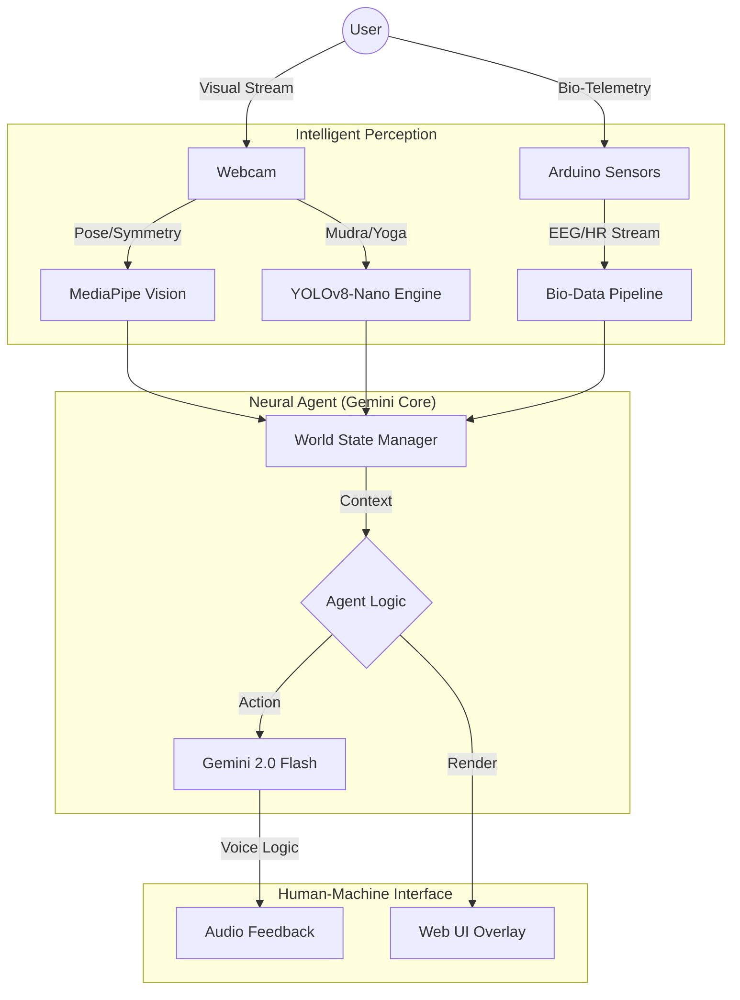

# 🧘‍♂️ YogaAI × BrainWave Analyzer 🧠
### **The Future of Agentic Bio-Feedback & Neural Synchronicity**


---

## ⚡ Recruiter's Executive Summary
**High-impact, full-stack AI/ML ecosystem** that bridges the gap between physical bio-data and agentic intelligence. This project demonstrates expertise in:
- **Real-time Edge Vision**: Custom YOLOv8-Nano and MediaPipe pipelines.
- **Agentic AI Architecture**: Google Gemini 2.0 Flash integration for closed-loop reasoning.
- **Hardware/IoT Engineering**: Serial data processing for EEG & Heart Rate sensors.
- **Scalable Web Dashboards**: Next.js 14 with high-performance visualization.

---

## 🏛️ Project Architecture



---

## 🚀 Key Innovation Pillars

### 👁️ 1. Precision Vision Engine
Trained on a bespoke dataset to recognize **Yoga Poses** and **Hand Mudras** at the edge.
*   **Categories**: 5 Poses (Tree, Warrior II, etc.) & 5 Mudras (Gyan, Prana, etc.).
*   **Latency**: Sub-30ms inference on CPU via YOLOv8 optimization.

### 🧠 2. Neuro-Link Integration
Unlike standard health apps, we analyze **Neural Synchronicity**.
*   **EEG Signal Analysis**: Alpha, Beta, and Theta wave tracking for deep focus estimation.
*   **Stress Correction**: Dynamic stress detection through Heart Rate Variability (HRV).

### 🤖 3. Agentic Guided Wellness
A passive monitor turned **Active Coach**.
*   The AI doesn't just watch; it **reasons**. Using Gemini 2.0, the app adjusts suggestions based on form errors and mental stress levels in real-time.

---

## 📊 Live Dashboard
*Experience the glassmorphism dashboard built for high-end visualization.*


---

## 🛠️ Tech Stack & Skills

| Domain | Technologies |
| :--- | :--- |
| **Generative AI** | Gemini 2.0 Flash, OpenAI (optional fallback) |
| **Computer Vision** | YOLOv8-Nano, MediaPipe, OpenCV, PyTorch |
| **Full-Stack Web** | Next.js 14 (App Router), TailwindCSS, Framer Motion |
| **Data & Signal** | NumPy, SciPy, Matplotlib, Serial Communication |
| **IoT & Hardware** | Arduino (C++), ESP32, Biosensors |

---

## 🚀 Vision & Roadmap
1. **Multi-User Neural Sync**: Connecting two minds via EEG dashboards.
2. **AI-Patient RAG**: Integrating medical history for personalized AI prescriptions.
3. **VR/AR Port**: Bringing the sanctuary to the Metaverse.

---

<p align="center">
  <b>Developed by Gaurang & Team</b><br>
  <i>Pushing the boundaries of Human-AI Synergy.</i>
</p>

---

### 📦 Installation Quickstart

```bash
# Vision Setup
cd Yoga_AI/Round2_Submission\ IIT\ BHU/Submission/Code
pip install -r requirements.txt
python predict.py

# Dashboard Setup
cd neuro-link-app
npm install && npm run dev
```
