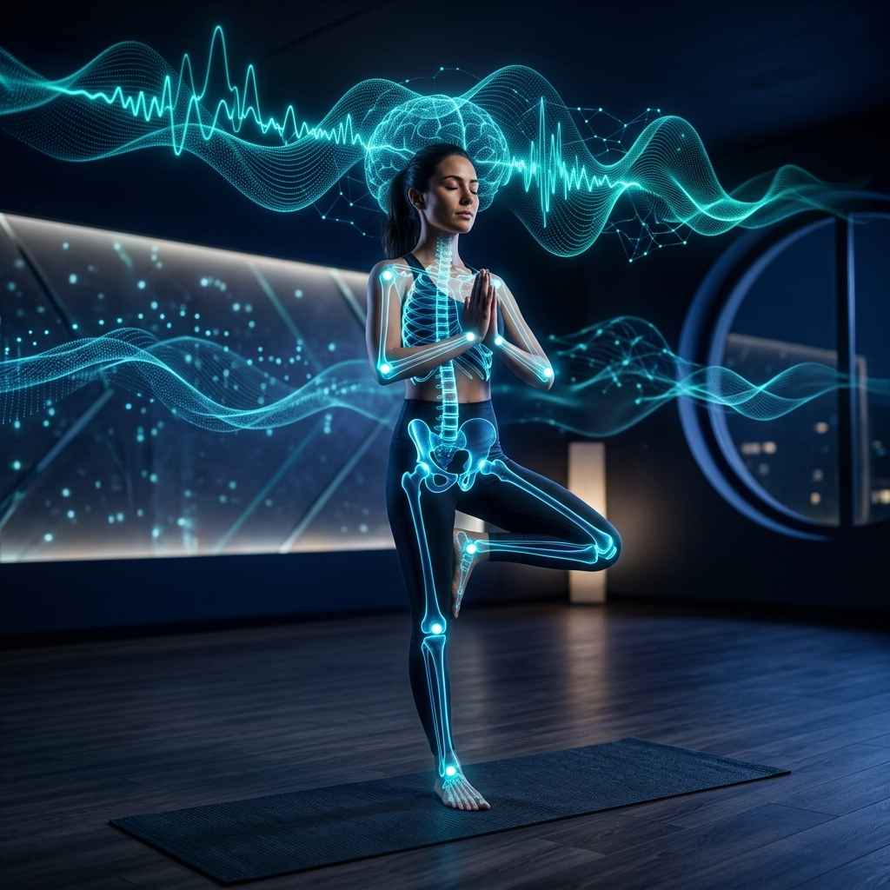
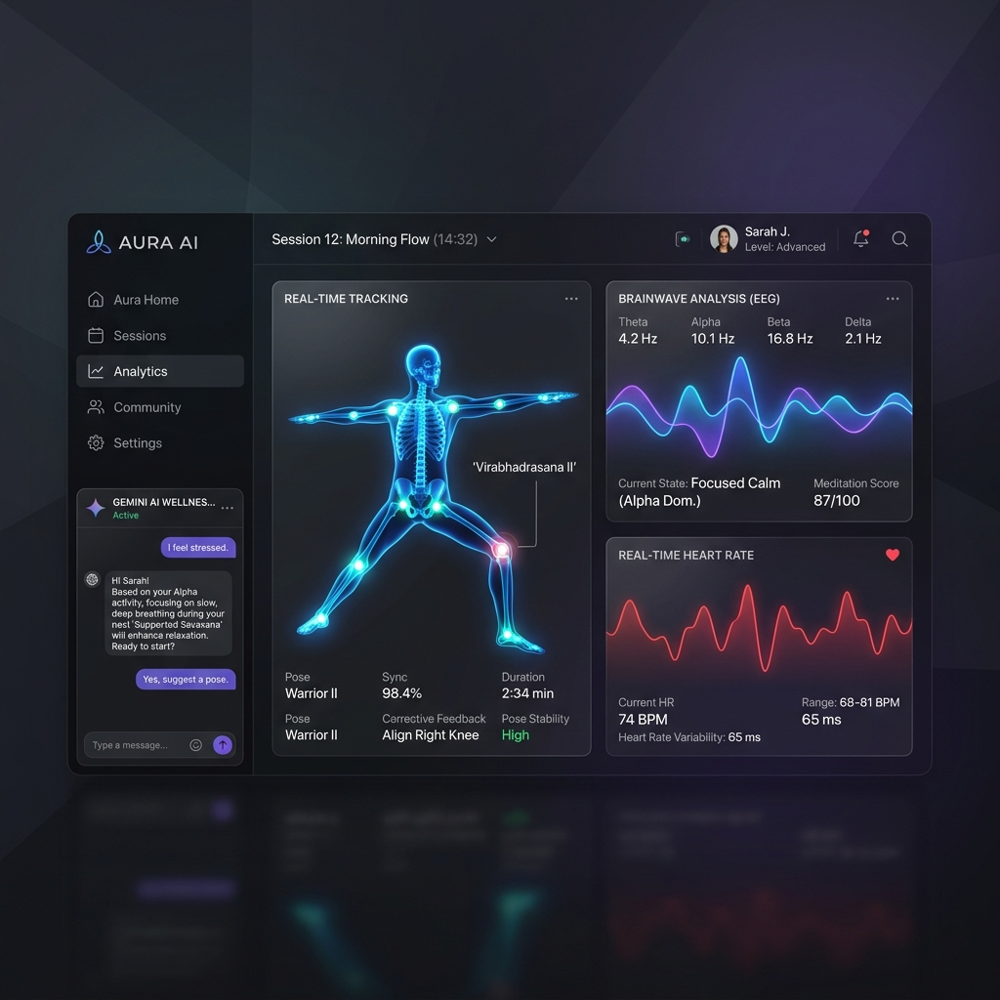
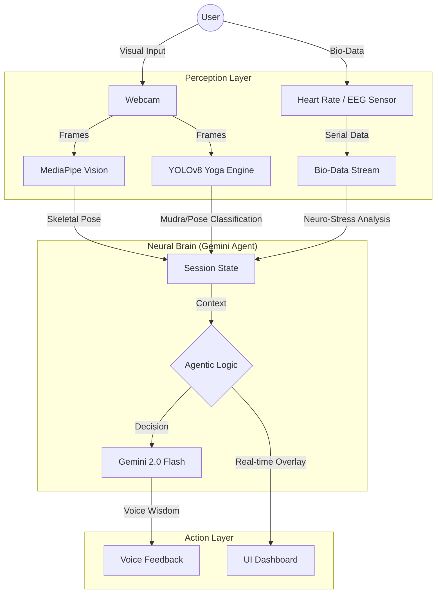

# ðŸ§˜â€ â™‚ï¸ YogaAI × BrainWave Analyzer 🧠
### **Merging Ancient Wisdom with Agentic Intelligence & Neuro-Bio-Feedback**



[](https://opensource.org/licenses/MIT)
[](https://www.python.org/downloads/)
[](https://nextjs.org/)
[](https://ultralytics.com/)
[](https://deepmind.google/technologies/gemini/)

---

## 🌟 The Vision
**YogaAI** is not just an app; it's a closed-loop **Agentic Wellness Ecosystem**. By combining high-precision computer vision (YOLOv8 & MediaPipe) with real-time bio-telemetry (EEG Brainwaves & HEART_RATE), we've created a digital sanctuary that understands your physical form and mental state simultaneously.

> "True health is the synchronization of the body, the breath, and the mind."

---

## ✨ Key Pillars

### 👠1. Vision Core (YOLOv8-Nano)
Detects **5 Yoga Poses** and **5 Sacred Mudras** with edge-optimized real-time frequency.
- **Poses**: Tree, Warrior II, Downward Dog, Cobra, Plank.
- **Mudras**: Gyan, Prana, Prithvi, Varun, Surya.
- *Technology*: Custom trained YOLOv8 model for ultra-low latency.

### 🧠 2. Neuro-Link Sync
Analyzes **EEG Brainwave patterns** and **Neural Synchronization** between participants.
- Real-time visualization of Alpha, Beta, and Delta waves.
- Stress Level analysis derived from Heart Rate variability.
- *Technology*: Arduino-based sensors with high-frequency serial stream.

### 🤖 3. Agentic Wisdom (Gemini 2.0 Flash)
Your session isn't just monitored; it's **guided**.
- Gemini-powered AI Wellness Coach provides real-time voice feedback.
- Context-aware advice based on current Pose accuracy and Bio-stress levels.
- *Technology*: Zero-shot reasoning via Gemini 2.0.

---

## ðŸ–¥ï¸ Premium Dashboard



---

## 💻 System Architecture



---

## 🚀 Tech Stack

- **Frontend**: Next.js 14, TailwindCSS, Framer Motion (for liquid UI).
- **Computer Vision**: YOLOv8-Nano, MediaPipe, OpenCV.
- **Generative AI**: Google Gemini 2.0 Flash (Agentic reasoning).
- **Internet of Things (IoT)**: Arduino, C++, Serial Communication.
- **Data Engineering**: NumPy, Matplotlib (for EEG signal processing).

---

## 📦 Installation & Usage

### 1. Vision Engine
```bash
cd Yoga_AI/Round2_Submission\ IIT\ BHU/Submission/Code
pip install -r requirements.txt
python predict.py # Test the model
python visualize.py # See detection visuals
```

### 2. Web Dashboard
```bash
cd neuro-link-app
npm install
npm run dev
```

### 3. Neuro-Hardware
- Flash the `.ino` files found in `arduino_eeg` and `arduino_heart_rate` to your compatible Arduino/ESP32 board.

---

## 📈 Roadmap
- [ ] Multi-user Neural Synchronization Dashboard.
- [ ] Personalized Ayurvedic health recommendations via RAG (Retrieval Augmented Generation).
- [ ] Integration with VR for Immersive Yoga environments.

---

## 🤠Contributing
We believe in the power of open-source wellness. Pull requests for new Poses, Mudras, or improved EEG signal processing are welcome!

## 📜 License
Distributed under the **MIT License**. See `LICENSE` for more information.

---

<p align="center">
  <b>Built with â¤ï¸ by Aditya & Gaurang</b><br>
  <i>Transforming the future of Wellness through AI</i>
</p>
